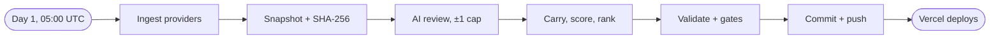

<div align="center">

# Veracity

**A monthly register that checks the papers on every tokenized-stock venue.**

[Site](https://www.useveracity.site) · [Latest edition](https://www.useveracity.site/editions/2026-10) · [Edition JSON](https://www.useveracity.site/editions/2026-10.json) · [Method](https://www.useveracity.site/method)

[](https://github.com/ivankusuma07/veracity-project)
[](https://x.com/veracity1o)

*Most venues launch memecoins. The real stock shows up only as the pairing asset. Veracity measures that gap.*

</div>

Each venue is scored 0 to 1000 and placed in a karat band; 375, the hallmark, is the line between listed and certified. Hanko, a Shiba Inu who works as the register's inspector, stamps the ones that pass.

Behind the page it works like Fineness: same scoring, bands, editions, pipeline, desk and fee router mechanics, on Robinhood Chain mainnet (4663). The layout, copy, character and code are new. The plan is in `veracity-project-plan.md`.

## The score

Five criteria, each an integer from 0 to 10, set by editorial judgement and written into a rationale with its sources. The veracity is the weighted mean times 100, rounded once (`src/scoring/veracity.ts`).

| Criterion | House weight | What it asks |
|---|---|---|
| Asset | 30% | What backs the pair, and can you check it |
| Traction | 25% | Volume, share, fees, pool depth |
| Transparency | 20% | Verified contracts, locks, docs, a named operator |
| Compliance | 15% | Licences, prospectus, disclosure |
| Durability | 10% | Age, shocks survived, dependencies |

| Band | Veracity |
|---|---|
| 22k | 916 and up |
| 18k | 750 to 915 |
| 14k | 585 to 749 |
| 9k | 375 to 584 |
| Below hallmark | under 375: listed, not certified |

Readers can reweigh the criteria on the judge's sheet. The weights go into a `?w=` link, and whoever opens it sees that order on first paint. Ranks, bands and month-on-month deltas in an edition are always at house weights. The full method is in `docs/METHOD.md`.

## What the register promises

- **Nulls stay null.** A figure nobody published shows as "not published", never zero or a guess.
- **One point a month.** A criterion moves at most ±1 per edition, on new public evidence written into its rationale. An AI reviewer may propose; code clamps it; two people sign off (`docs/SCORE-POLICY.md`).
- **Frozen editions.** Each edition is hashed against its raw snapshot and never edited. Mistakes get a dated correction with the original left in view (`docs/REGISTER-SCOPE.md`).
- **No paid placement.** Nobody pays for inclusion, placement or removal, and there are no affiliate or referral links.
- **Open data.** Every edition is a plain JSON file at a fixed address, open CORS, no key.

## The monthly run



`scripts/monthly.ts` pulls DefiLlama, Bitquery and explorer figures, writes and hashes the snapshot, asks the AI reviewer for moves inside ±1, carries every other score, validates the edition and pushes it. Without LLM credentials every score carries unchanged. `--strict` turns any policy warning (a move past ±1, a move whose rationale didn't change) into a stopped run, and any failure removes the new snapshot, so the previous edition stays live. Step by step in `docs/RUNBOOK.md`.

## Pages

| Route | What it is |
|---|---|
| `/` | The latest edition: the claim, the register with the judge's sheet, criteria matrix, custody and papers, struck-off venues, data, bands, the sniff test, method chapters, FAQ |
| `/editions/[edition]` | One frozen page per month. Unknown editions 404 |
| `/editions/:id.json` | The edition verbatim |
| `/venues`, `/venues/[id]` | Every venue, and each venue's paper: veracity across editions, scores with rationale, custody, figures, contracts |
| `/method` | Weights, bands, the registration standard, when a score may move, corrections, integrity |
| `/fee-router` | The token's fee router. Preview mode until the contracts are deployed |
| `/desk` | Internal review desk. Not linked, not indexed |

## Run it

Needs Node 20.9 or later and pnpm 11.

```
pnpm install
pnpm dev            # http://localhost:3000
```

| Command | What it does |
|---|---|
| `pnpm test`, `pnpm test:watch` | Unit and acceptance tests (Vitest), including the no-em-dash check |
| `pnpm e2e` | Builds, starts and runs the Playwright suite with video, trace and screenshots in `e2e/results` |
| `pnpm e2e:smoke` | Smoke tests only. Set `E2E_BASE_URL` to check a deploy (or a running `pnpm dev`) |
| `pnpm e2e:record` | Records a new spec with Playwright codegen |
| `pnpm monthly` | Builds next month's edition. Flags: `--edition=YYYY-MM`, `--as-of=YYYY-MM-DD`, `--published=YYYY-MM-DD`, `--strict`, `--commit` |
| `pnpm art:export` | Writes the seal SVGs to `art/hanko/` |
| `pnpm build`, `pnpm start` | Production build and server |
| `pnpm typecheck`, `pnpm lint` | The usual |

One-off scripts, run with `pnpm tsx scripts/<name>.ts`:

| Script | What it does |
|---|---|
| `launch-scan.ts <scan.json>` | Counts every launch a launchpad made from its factory's event logs, and what each pairs against |
| `launch-figures.ts <scan.json>` | Daily volume and liquidity for a launchpad no provider tracks, from the scan's asset list and DexScreener |
| `fetch-venue-icons.ts` | Downloads each venue's official logo into `public/venues/` and regenerates `src/site/venue-icons.ts` |
| `record-demo.ts [out-dir]` | Records the narrated walkthrough in `demo/` with Playwright |

Copy `.env.example` to `.env.local`. Every variable is optional: without provider keys figures stay "not published", without LLM keys scores carry, and without contract addresses the fee router stays in preview mode. Keys live in `.env.local` (git-ignored) and in the Vercel and Railway settings, never in the repo.

## Where things are

```
app/                 routes (see Pages)
data/editions/       frozen editions, one JSON file per month
data/snapshots/      raw monthly pulls, hashed into each edition
data/sources.json    every source an edition may cite
src/scoring/         veracity(), band(), normalise()
src/build/           edition, carry, deltas, validate, admission, score-moves
src/ingest/          DefiLlama, Bitquery and explorer providers, venue mappings
src/llm/             the OpenAI-compatible client and the guarded review
src/site/            components, the seal, the edition loader, weight URLs, share cards
public/hanko/        Hanko: the hero renders, pixel-art scenes and sprites
public/images/       chapter backdrops
public/venues/       venue logos
art/hanko/           the seal as SVG, Hanko as PNG for share cards
scripts/             the monthly job, the Railway entry and the one-off scripts
e2e/, tests/         Playwright and Vitest
demo/                the recorded walkthrough
docs/                method, runbook, score policy, scope, data and licensing
```

Built with Next.js 16 (App Router), React 19, TypeScript, Tailwind CSS 4, Motion and GSAP, and viem for the chain.

## Hanko's art

Hanko is raster art in `public/hanko/`, in two styles:

- **Hero:** two photoreal renders, `stamp-up.webp` and `stamp-down.webp`, swapped on a loop by `HankoDesk`. Each stamp pops a badge with the next venue's band and score. Clicking him rushes the stamping; the loop pauses off screen and holds the stamped pose with reduced motion.
- **Everywhere else:** 16-bit pixel art. `step-fetch`, `step-judge` and `step-freeze` are the banners on "How an edition is made". `inspector` is the corner widget and the FAQ. `sniff-wary`, `sniff-calm` and `sniff-alert` follow the sniff-test score, and the 404 reuses `sniff-wary`.

When replacing art, keep the file names. Pairs that swap in place (the two hero poses, the three sniff moods) must stay pixel-aligned with each other, and every cut-out needs real transparency, not a painted checkerboard. Share cards are drawn by next/og, which cannot decode webp, so `art/hanko/` keeps PNG copies of `stamp-down`, `sniff-high` (alert) and `sniff-low` (wary).

The seal (logo, favicon, edition seal) stays SVG in `src/site/art/Seal.tsx`, since its ring text is set per edition and it has to hold up at 32px.

## Deploy

- **Site:** Vercel, from `main`. Editions are read from `data/` at request time; `next.config.ts` traces that folder into the server bundle.
- **Monthly job:** Railway cron (`railway.json`, `0 5 1 * *`, via `scripts/railway-monthly.sh`). Needs `GITHUB_TOKEN` and `GITHUB_REPOSITORY` to push the edition. Any failure exits non-zero and pushes nothing, so the previous edition stays live.
- **CI:** `.github/workflows/ci.yml` runs types, lint, unit tests and the recorded e2e suite on Node 22, and uploads the recordings.

## Status

Edition 2026-10 is built from an evidence review of every venue (October 2026): pairings, issuers and custodians, verified contracts on the Robinhood Chain explorer, DefiLlama figures pulled by the ingest code itself, and launch counts for Long.xyz and Pons from their factories' event logs. Each score's rationale cites its evidence. Venues DefiLlama doesn't track (Long.xyz, Factory New) show their figures as "not published".

Veracity scores are editorial judgements on public information. Not an audit, a credit rating or investment advice.
